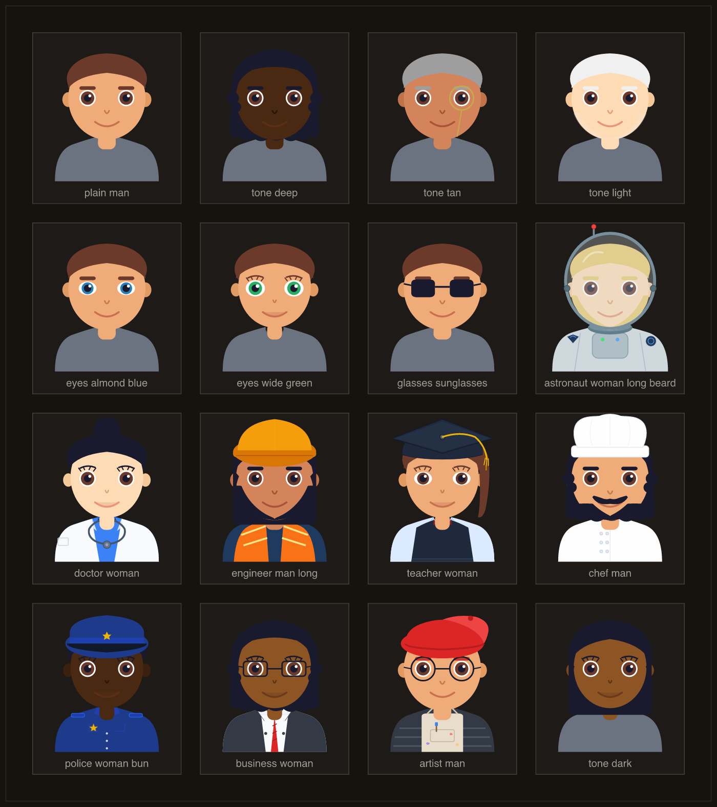
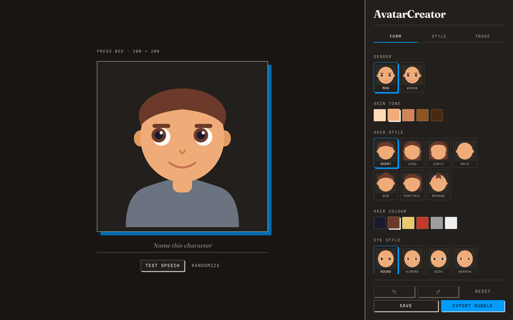
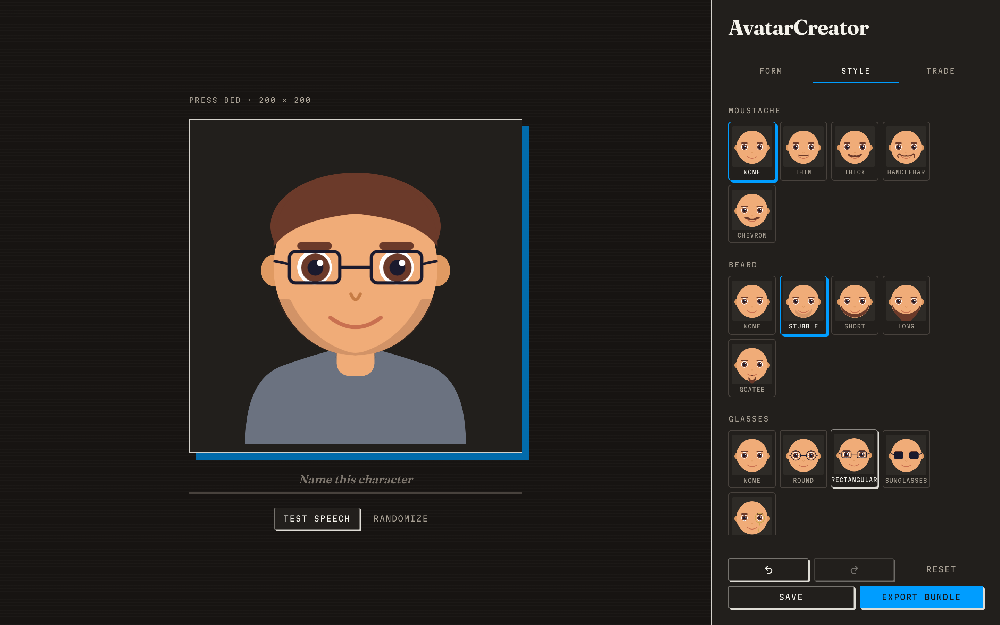
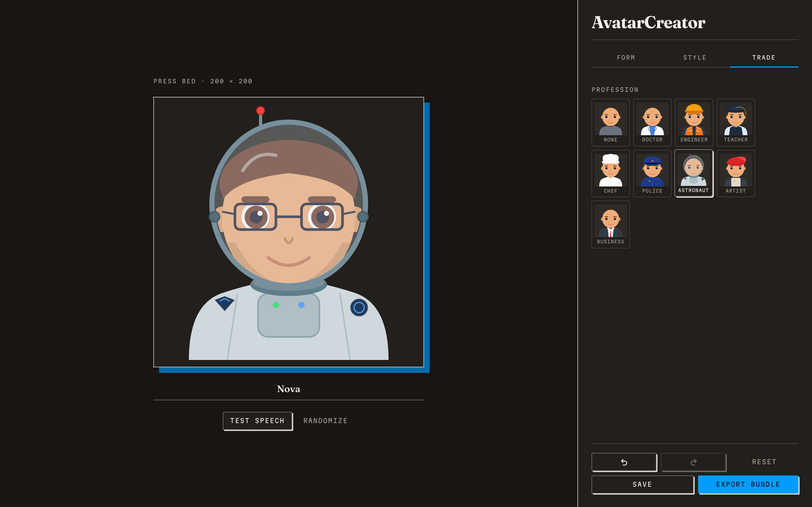
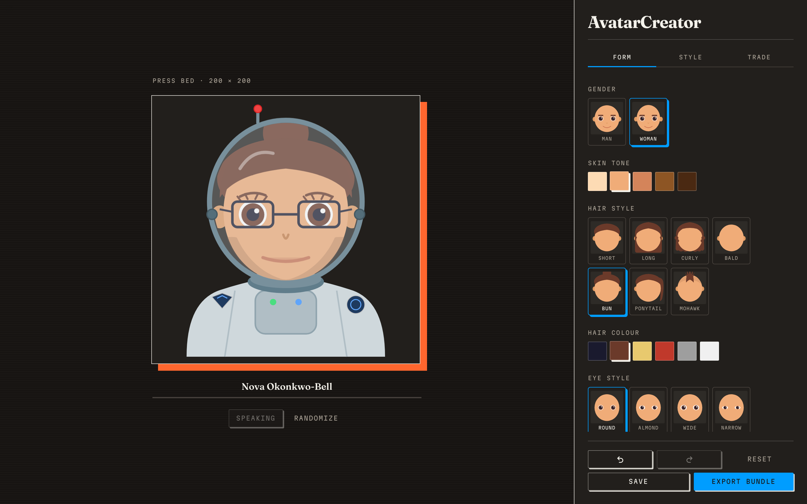
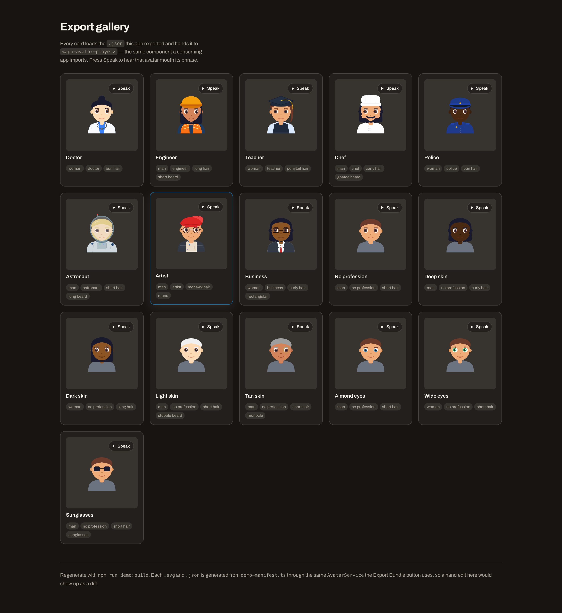
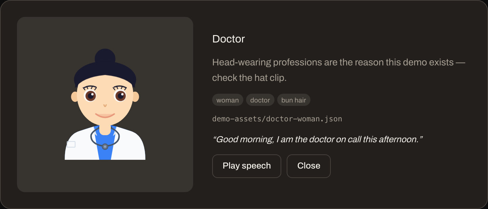
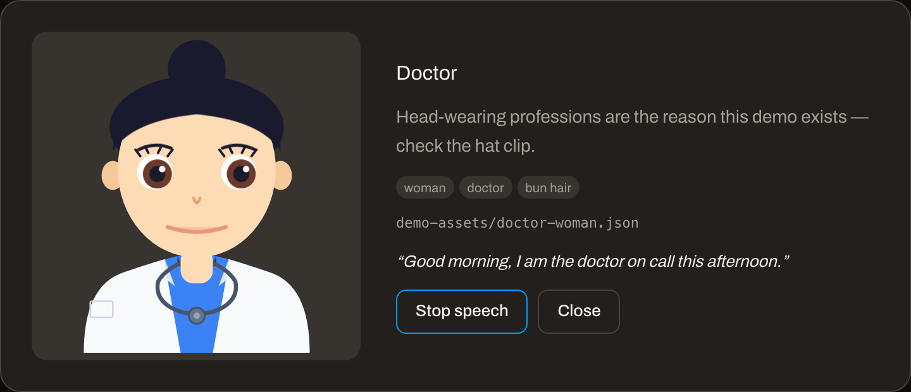

# miniAvatar

A flat spot-colour **SVG avatar creator** and a drop-in **Angular player** for
the avatars it makes. Design a face in the browser, export it as data, then
animate and speak it in any other app.



- **Creator** — 11 traits, live SVG preview, undo/redo, randomize, lip-sync
  preview, `.zip` export.
- **`avatar-shared`** — the `AvatarConfig` model and the single SVG renderer.
  No Angular, no DOM.
- **`avatar-player`** — blinking, eye movement, head idle motion and lip sync
  as a single component you drop into your app.
- **Export fidelity is enforced, not hoped for.** The on-screen avatar, the
  exported `avatar.svg` and the player all render through the same function, so
  what you design is what ships.

Built with Angular 19, Tailwind and Spartan NG. Every avatar is 200×200 vector
SVG — no images, no fonts, no runtime assets.

---

## Screenshots

**Creator — form traits.** Gender, skin tone, hair, eyes. Every thumbnail is
rendered from the same part geometry the avatar uses, so a preview can never
drift from the result.



**Creator — style traits.** Moustache, beard and glasses.



**Creator — profession layers.** Hats and helmets clip the hair underneath them.



**Test speech.** The avatar mouths its name through the same viseme mapping the
player uses.



**Export gallery (`/demo`).** Every card loads a `.json` this app exported and
hands it to the real `<app-avatar-player>` — press **Speak** to hear that avatar
mouth its phrase.



**The player, idle and speaking.** The exported config, nothing else.

| Idle | Speaking |
|---|---|
|  |  |

---

## Quick start

```bash
git clone <this-repo>
cd miniAvatar/avatar-workspace
npm install
npm start
```

Open <http://localhost:4200>.

| Route | What it is |
|---|---|
| `/` | The creator |
| `/demo` | Gallery of exported avatars, each played by the real player |
| `/diag` | Internal beard-geometry diagnostic — temporary, not part of the product |

Requires Node 18+ (developed on Node 20/25).

---

## Using the creator

Traits live in three tabs:

- **Form** — gender, skin tone, hair style, hair colour, eye style, eye colour
- **Style** — moustache, beard, glasses
- **Trade** — profession layer (doctor, engineer, teacher, chef, police,
  astronaut, artist, business)

On the press bed:

- **Name plate** — display name; also the download filename.
- **Test speech** — lip-syncs the name (or a default line) so you can check the
  mouth shapes for that face.
- **Randomize** — rolls a whole character, weighted toward the realistic
  options.

In the footer:

- **Undo / Redo** — 60 steps. Name edits collapse into a single step, so typing
  doesn't flood the history.
- **Reset** — back to defaults.
- **Save** — stores the config in `localStorage` and restores it on reload.
- **Export Bundle** — downloads a `.zip`.

### The export bundle

```
nova.zip
├── avatar.json     the config — this is what a player consumes
├── avatar.svg      static 200×200 standalone rendering
└── README.md       the schema, shipped with the bundle
```

The bundle carries **data only**. No player code, no runtime: the consuming app
already has a player, and this is what you feed it.

### `avatar.json`

One `AvatarConfig` object, no wrapper and no version envelope:

```json
{
  "id": "avatar_1750000000000_a1b2c3",
  "name": "Nova",
  "gender": "woman",
  "skinTone": "medium",
  "haircut": "bun",
  "hairColor": "black",
  "eyeColor": "brown",
  "mustache": "none",
  "beard": "none",
  "eyeStyle": "round",
  "glasses": "none",
  "profession": "astronaut"
}
```

| Field | Values |
|---|---|
| `gender` | `man` · `woman` |
| `skinTone` | `light` · `medium` · `tan` · `dark` · `deep` |
| `haircut` | `short` · `long` · `curly` · `bald` · `bun` · `ponytail` · `mohawk` |
| `hairColor` | `black` · `brown` · `blonde` · `red` · `gray` · `white` |
| `eyeColor` | `brown` · `blue` · `green` · `gray` · `black` |
| `mustache` | `none` · `thin` · `thick` · `handlebar` · `chevron` |
| `beard` | `none` · `stubble` · `short` · `long` · `goatee` |
| `eyeStyle` | `round` · `almond` · `wide` · `narrow` |
| `glasses` | `none` · `round` · `rectangular` · `sunglasses` · `monocle` |
| `profession` | `none` · `doctor` · `engineer` · `teacher` · `chef` · `police` · `astronaut` · `artist` · `business` |

**Unknown values are not rejected.** A missing or misspelled field falls back to
that trait's default instead of raising, so a bad config renders *plausible but
wrong*. When a face looks subtly off, check it against this table first.

---

## Using the player

### 1. Get the two libraries

**In this repo** they resolve through `tsconfig.json` paths — nothing to install:

```jsonc
"paths": {
  "@avatar-workspace/avatar-shared": ["src/libs/avatar-shared/src/index.ts"],
  "@avatar-workspace/avatar-player": ["src/libs/avatar-player/src/index.ts"]
}
```

**In another app**, build them and install the output:

```bash
npm run build:libs        # → dist/avatar-shared, dist/avatar-player
```

```bash
npm install file:../miniAvatar/avatar-workspace/dist/avatar-shared \
            file:../miniAvatar/avatar-workspace/dist/avatar-player
```

Both are `ng-packagr` libraries, so they arrive as proper Angular packages with
partial-Ivy output. `avatar-player` depends on `avatar-shared`, and both peer-depend
on Angular 19.

### 2. Register it

Module-style, once, in `app.config.ts`:

```ts
import { importProvidersFrom } from '@angular/core';
import { AvatarPlayerModule } from '@avatar-workspace/avatar-player';

export const appConfig: ApplicationConfig = {
  providers: [importProvidersFrom(AvatarPlayerModule)],
};
```

Or skip the module and import the standalone component where you need it:

```ts
import { AvatarPlayerComponent } from '@avatar-workspace/avatar-player';

@Component({
  imports: [AvatarPlayerComponent],
  template: `<app-avatar-player [config]="avatar" [message]="line" [speaking]="talking" />`,
})
export class ChatBubble {}
```

### 3. Drop it in

```html
<app-avatar-player
  [config]="avatar"
  [message]="line"
  [speaking]="talking"
  [idsPrefix]="'agent-' + agentId"
  [size]="64" />
```

| Input | Type | Default | Meaning |
|---|---|---|---|
| `config` | `AvatarConfig` | *required* | The avatar to render |
| `message` | `string` | `''` | Text to mouth while `speaking` |
| `speaking` | `boolean` | `false` | Plays the lip sync and grows the avatar 1.5× |
| `idsPrefix` | `string` | `''` | Namespace for generated `clipPath` ids — **required for more than one player on a page** |
| `size` | `number` | `48` | Edge length in px |

> **Why `idsPrefix` matters.** Every avatar emits `url(#hat-clip)`, which
> resolves against the *first* matching element in the document. Without a unique
> prefix per avatar, they all clip against whichever rendered first and hats
> stop hiding hair. Pass one id per player instance.

### Driving the mouth yourself

For full control, bypass `speaking`/`message` and use the service. It returns a
cancel function, and `onEnd` fires exactly once per utterance:

```ts
import { LipSyncService } from '@avatar-workspace/avatar-player';

private lipSync = inject(LipSyncService);

speak(text: string): void {
  this.cancel?.();
  this.cancel = this.lipSync.play(
    this.lipSync.textToVisemes(text),
    (v) => this.viseme.set(v),
    () => this.talking.set(false),
  );
}
```

Do not infer the end from `onViseme(0)`: viseme `0` is silence and occurs at
every space, so that ends the utterance at the first word gap.

### The lower-level component

`app-svg-avatar` is the renderer without the speech wrapper, if you want to own
the viseme:

```html
<app-svg-avatar [config]="avatar" [animationsEnabled]="true" [viseme]="viseme()" />
```

| Input | Type | Default | Meaning |
|---|---|---|---|
| `config` | `AvatarConfig` | *required* | The avatar to render |
| `animationsEnabled` | `boolean` | `true` | Blinking, eye movement, head idle motion |
| `viseme` | `number` | `0` | `0`–`5`; `0` is silence |
| `idsPrefix` | `string` | `''` | See above |

---

## Using the renderer without Angular

`avatar-shared` has no Angular or DOM dependency, so it also works in Node — a
build script, a test, or a server-side generator:

```ts
import { buildAvatarSvg, textToVisemes } from '@avatar-workspace/avatar-shared';

const svg = buildAvatarSvg(config);   // standalone 200×200 SVG document
const visemes = textToVisemes('hello');
```

`textToVisemes` is deliberately **not** a phoneme model: unmapped consonants fall
back to the "spread" shape, so it reads as *the mouth is moving* rather than
accurate speech. Don't present it as phonetics.

---

## Gotchas worth knowing

- **Inlining several exported `avatar.svg` files into one page breaks.** The
  `clipPath` ids inside them (`face-clip`, `hat-clip`, `helmet-clip`) collide,
  and `url(#hat-clip)` then resolves against the first match, so every avatar
  clips identically. Namespacing is the consumer's job — the Angular player does
  it via `idsPrefix`.
- **The exported SVG is static on purpose.** No blinking, no head motion, no lip
  sync. Use it for avatars, thumbnails and chat-list icons; use `avatar.json`
  when the avatar needs to animate or speak.
- **Unknown config values fail silently**, as described above.

---

## Project layout

```
miniAvatar/
├── docs/
│   ├── images/avatars.png          README hero, generated from the demo SVGs
│   └── screenshots/                captured from the running app
└── avatar-workspace/
    ├── src/
    │   ├── app/
    │   │   ├── pages/creator/      the creator page
    │   │   ├── demo/               export gallery + its committed assets
    │   │   ├── diag/               temporary beard diagnostic
    │   │   ├── services/           avatar state, persistence, export, zip
    │   │   └── ui/                 trait + swatch pickers, Spartan wrappers
    │   └── libs/
    │       ├── avatar-shared/      model, palettes, SVG renderer, visemes
    │       └── avatar-player/      components + animation and lip-sync services
    └── scripts/                    demo generation, bundle check, doc images
```

The `src/libs/*` folders are the product. `src/app` is one consumer of them.

## Scripts

Run from `avatar-workspace/`:

| Command | What it does |
|---|---|
| `npm start` | Dev server on <http://localhost:4200> |
| `npm run build` | Production build of the app |
| `npm run build:libs` | Builds both libraries into `dist/` |
| `npm test` | Karma/Jasmine unit tests |
| `npm run demo:build` | Regenerates `demo-assets/*.svg` and `*.json` from the manifest |
| `npm run verify:bundle` | Asserts the export bundle's exact payload |
| `npm run gallery` | Rebuilds `docs/images/avatars.png` (needs `@resvg/resvg-js`) |
| `npm run screenshots` | Recaptures `docs/screenshots/` (needs `playwright`) |

## Regenerating the README images

The avatar grid needs no browser:

```bash
npm i -D @resvg/resvg-js
npm run gallery
```

The UI screenshots do — it drives the running app, so what you get is what a
user sees:

```bash
npm i -D playwright && npx playwright install chromium
npm start -- --port 4210      # in another terminal
npm run screenshots
```

## License

MIT, as declared by both libraries' `package.json`. The repository root has no
`LICENSE` file yet — add one before publishing.
